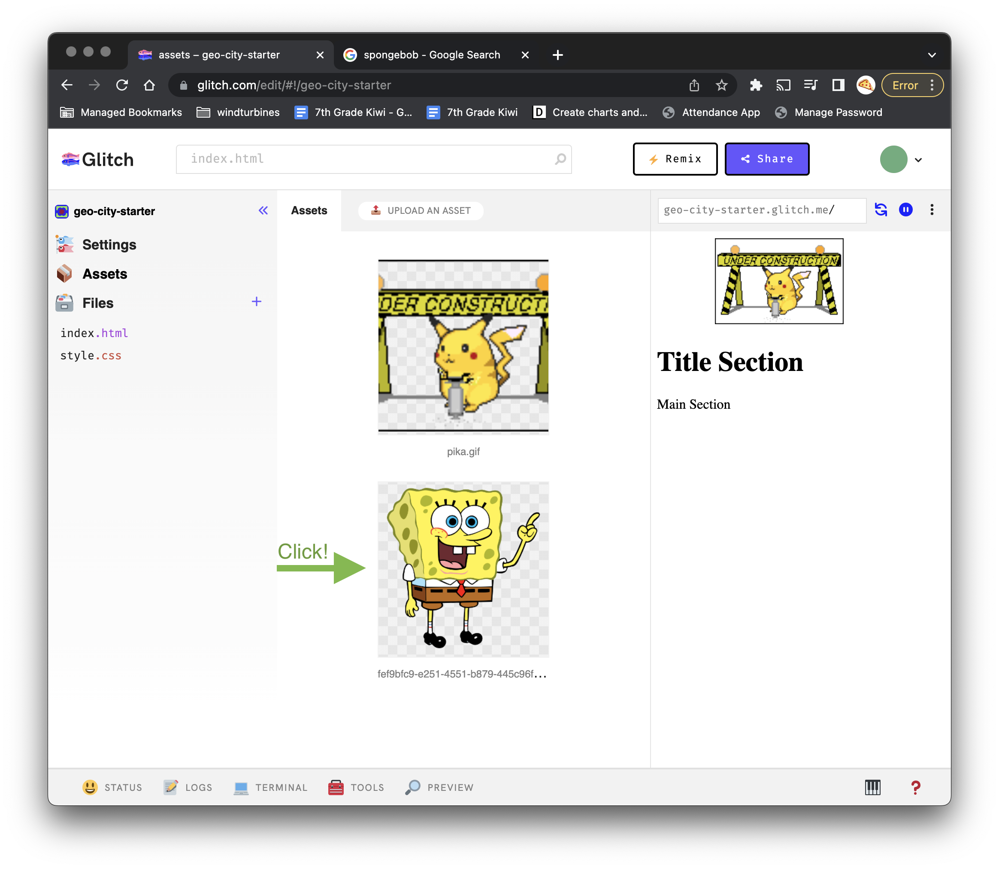
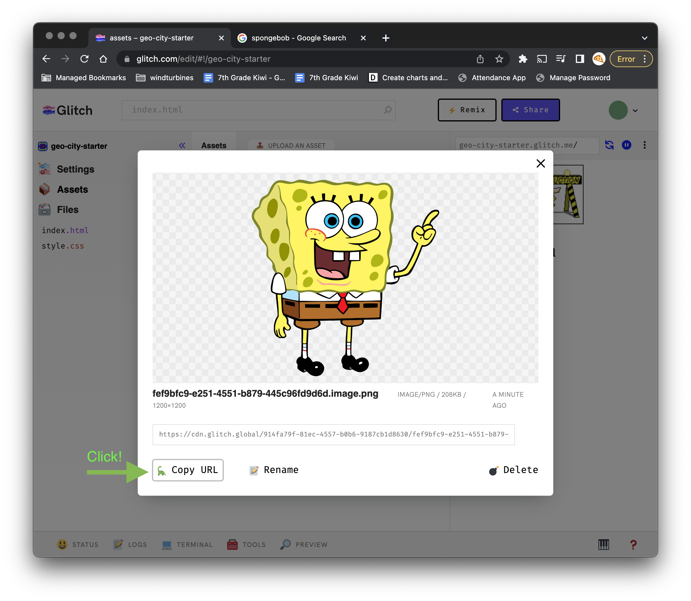
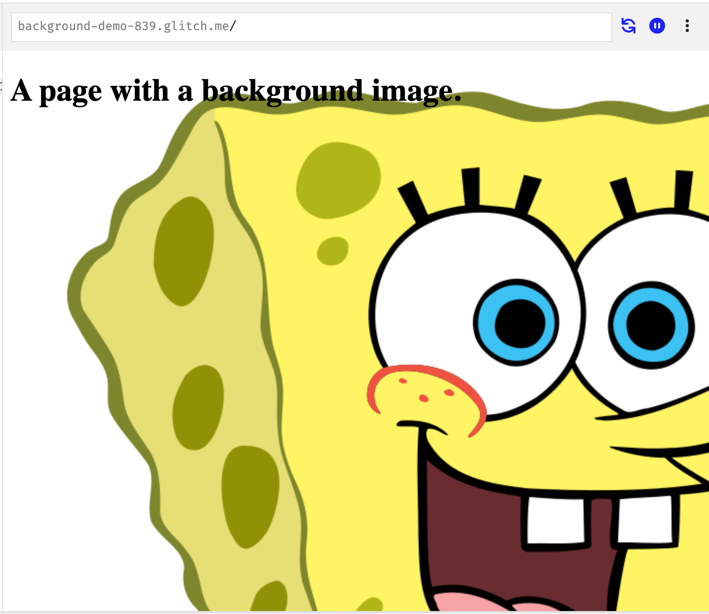
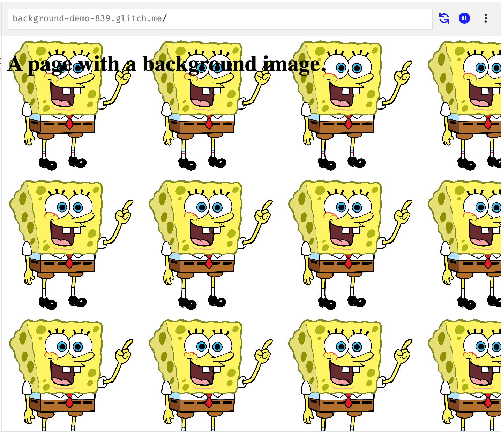
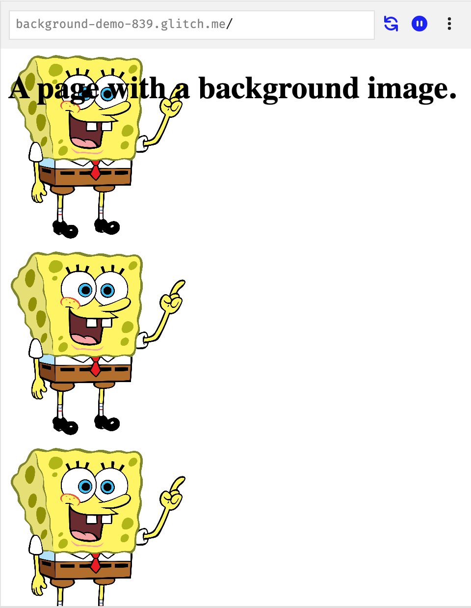
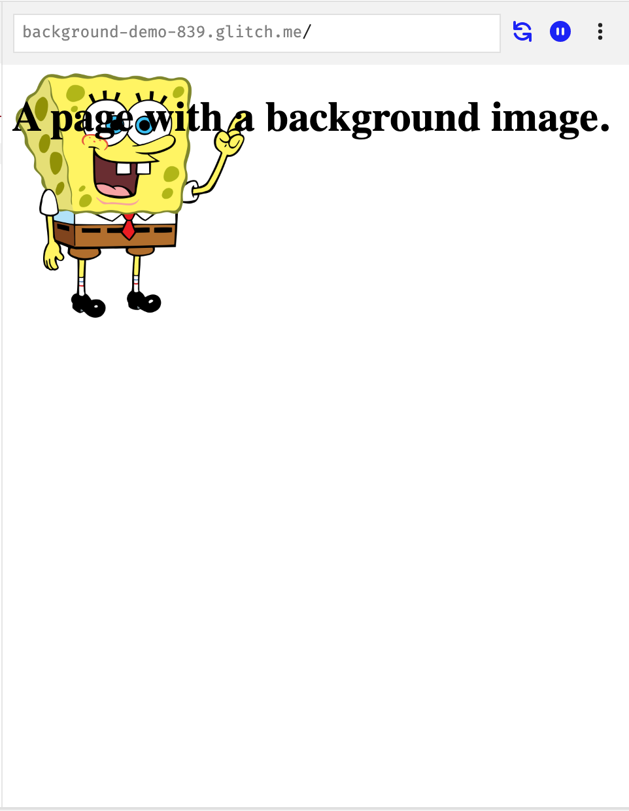
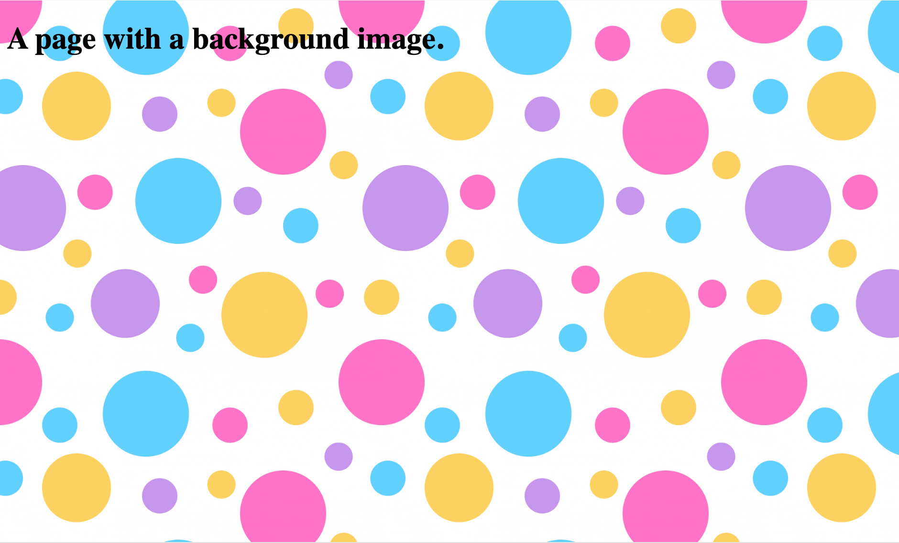

# Background Images
You can add a background image using CSS. Any element can get a background image, but this guide will show how to add one to the entire page.

## Find an Image
You can use any image as a background image.

- Copy the image and paste into Glitch.

- Find the image in the glitch assets.

- Copy the URL


## CSS
In the style.css page, add this rule to the body. Replace the ??? with the url you just copied.
```css
body {
  background-image: url(???);
}
```



You can set the size of the background image using the `background-size` property.
```css
body {
  background-image: url(???);
  background-size: 200px;
}
```



You will notice that the background automatically repeats in both directions. You can change this using the `background-repeat` property.

This will only repeat in the y (vertical) direction
```css
body {
  background-image: url(???);
  background-size: 200px;
  background-repeat: reapeat-y;
}
```



You can also get the background to stop repeating.

This will turn off repeats in both directions.
```css
body {
  background-image: url(???);
  background-size: 200px;
  background-repeat: no-repeat;
}
```
 


You can set the background to automatically resize based on the width of the window. 

This will contain the background image within the window.
```css
body {
  background-image: url(???);
  background-size: contain;
}
```
 
## Seamless and Textured Backgrounds
You can find many images that are designed to be background images that repeat. These are often called "seamless" backgrounds or textured backgrounds.



Here are some resource to find background images
- [Background Tiles](https://background-tiles.com/)
- [Public Domain Images](https://www.publicdomainpictures.net/en/hledej.php?page=0&hleda=seamless+pattern)
- [Textured Backgrounds](https://www.freepik.com/free-photos-vectors/texture-background)
