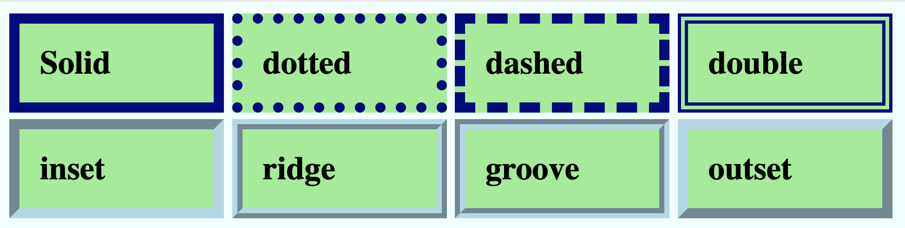

# Borders

You can add a border to any HTML element.
```css
selector {
  border-color: navy;
  border-size: 10px;
  border-style: solid;
}
```

`border-color` can be set to any color.
 
`border-size` can be set to any positive pixel or percent value.
 
Here are all the options for the border style property.
+ `border-style: dotted;` - Defines a dotted border
+ `border-style: dashed;` - Defines a dashed border
+ `border-style: solid;` - Defines a solid border
+ `border-style: double;` - Defines a double border
+ `border-style: groove;`- Defines a 3D grooved border. The effect depends on the border-color value
+ `border-style: ridge;` - Defines a 3D ridged border. The effect depends on the border-color value
+ `border-style: inset;` - Defines a 3D inset border. The effect depends on the border-color value
+ `border-style: outset;` - Defines a 3D outset border. The effect depends on the border-color value

Here is how the different styles compare visually.

