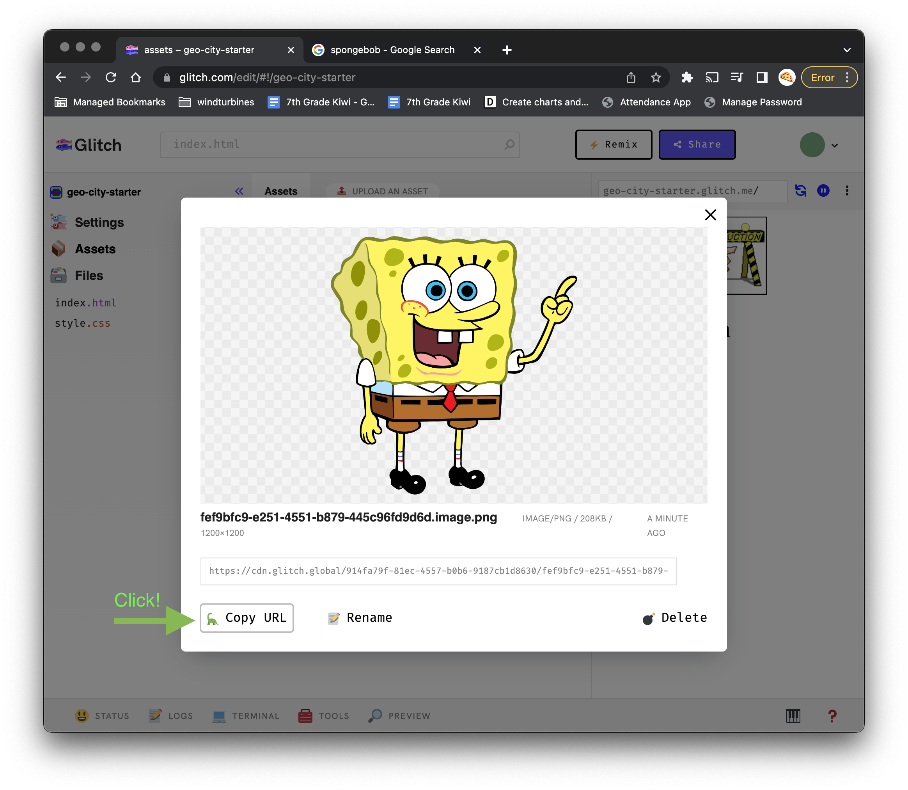

# Adding an Image

## Copy
- Find the image you want. Two finger click to save the image.

## Go to Glitch
- Back in Glitch, press command + v to to paste The image. This will take you to the Assets page. 
- Click the image you are trying to add.

- Click "Copy URL"

## In Index.html

- Type this code ``
- Past the url you copies in between the quotes 
