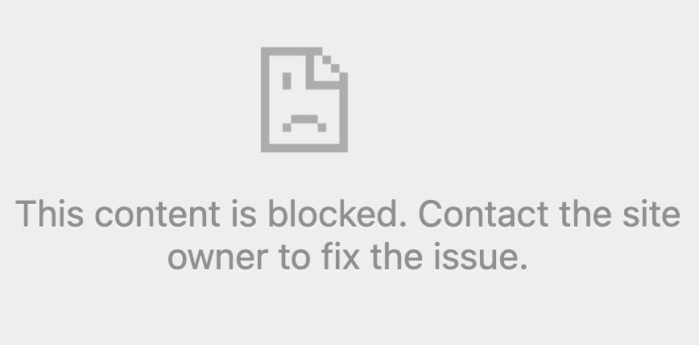
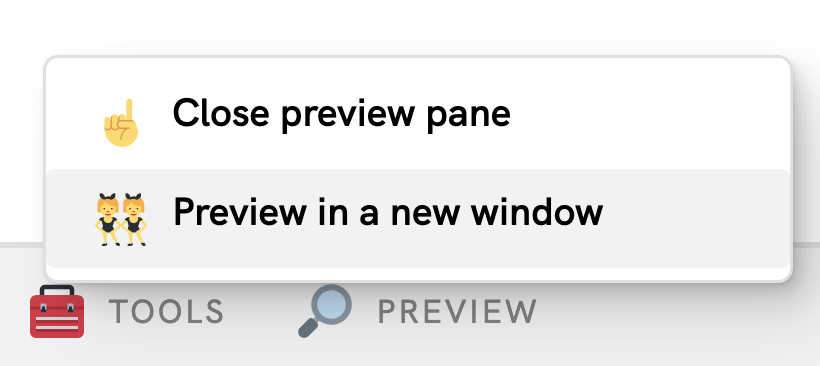
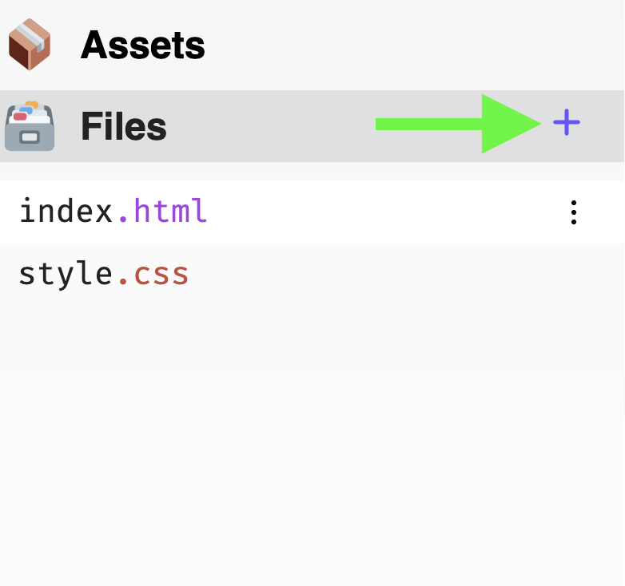
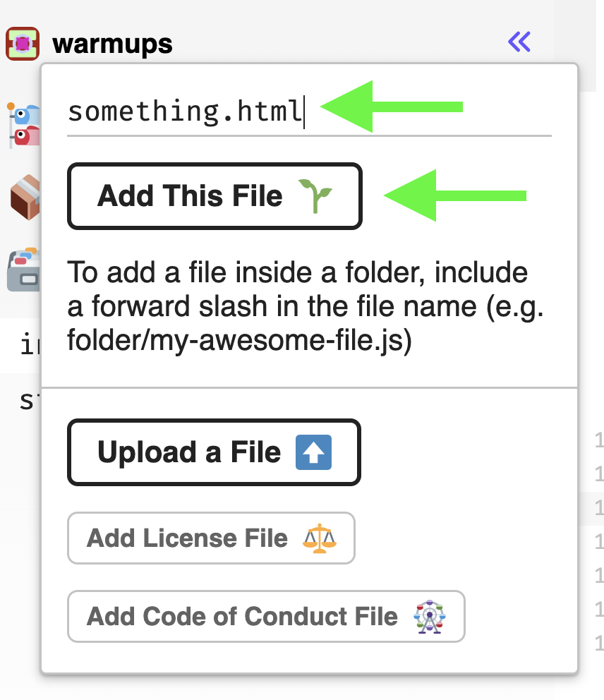

# Linking

## Linking to Other Pages.
Links are super easy. All you need is the url to a another page. Here is the HTML you need.

```html
<a href="url">Text People See</a>
```

In glitch, if you click you try clicking the link in the preview pane you will see this. 
 


Instead, open your page in a new window.
 


The links should work now!

## Linking to Your Pages 
Your site can have multiple pages, and you can link between your pages in the same way.

First, you need to create a new HTML file for your new page.
 

 
Give the new page a name.
 


Now you can add a link to your new page. The url is just the name of the new file you created.
```html
<a href="something.html">Text People See</a>
```

Your new page needs some HTML, so copy and paste this into your new page.
```html
<html>
  <head>
    <link rel="stylesheet" href="style.css" />
  </head>
  <body>
    <p>new page</p>
  </body>
</html>
```

## Anything Can Be a Link!
If you put an `<a>` tag around other html elements and they will become clickable links.

For example, this will make an image be a link.
```html
<a href="url">
  
</a>
```
 

  
