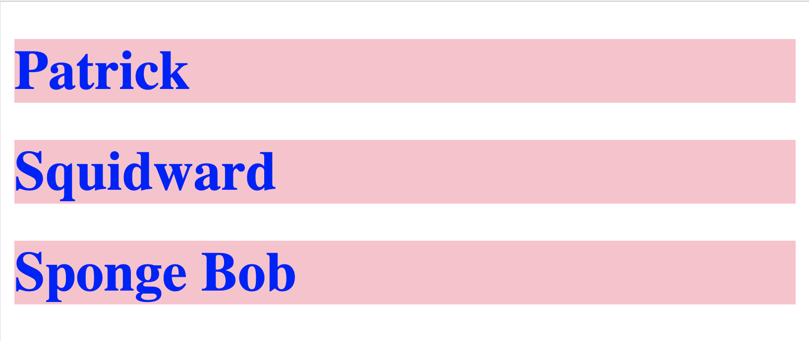
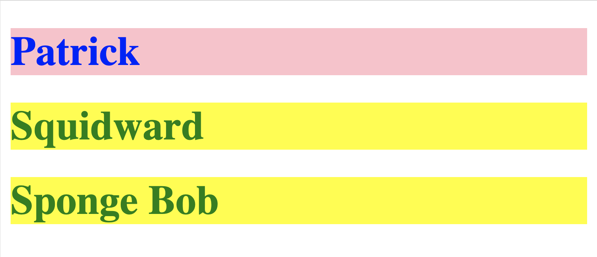
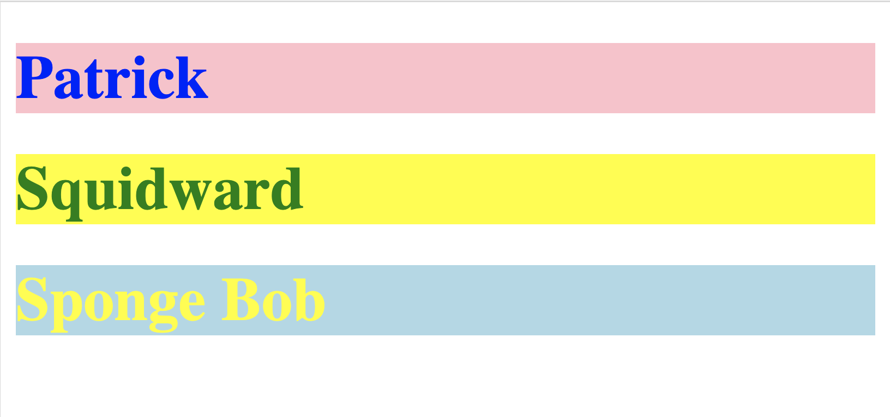

# Selectors
There are three primary ways to select HTML objects in CSS. Here they are in order from least specific to most specific.

Here is some basic HTML. We will use this so see how things are selected.
```html
<h1>
  Patrick
</h1>
<h1 class="pineapple">
  Squidward
</h1>
<h1 class="pineapple" id="spongebob">
  Sponge Bob
<h1>
```

## Tag Name
To select by tag name, just use the HTML tag name. This will select ALL elements with that tag.

Example, this will change all of the `h1` tags to be blue with a pink background:

```css
h1 {
  color: blue;
  background-color: pink;
}
```
The page will look like this.


## Class Name
In HTML, we can add a class name to any element.
```html
<h1 class="pineapple">Squidward</h1>
```
A class name can be anything, but cannot have a space (that would be two different classes) or start with a number. It can include a `-` or `_`.

Now in CSS, we can select any element with that class to get the rules. We use the `.` before the class name as the selector.
```css
.pineapple {
  color: green;
  backgrond-color: yellow;
}
```
Now, our page will look like this. Notice, it selects both Squidward and Sponge Bob because they BOTH have `class="pineapple"` in their opening tag.


## ID Name
Adding an ID is the most specific constructor. It will override all other rules.

In HTML, we add the ID attribute in the opening tag.
```html
<h1 id="spongebob">Sponge Bob</h1>
```

In CSS, we use the `#` symbol before the ID name to select that ID.
```css
#spongebob {
  color: yellow;
  background-color:lightblue;
}
```

Now, our page will look like. Only Sponge Bob changed colors, all other tags were unaffected. 


