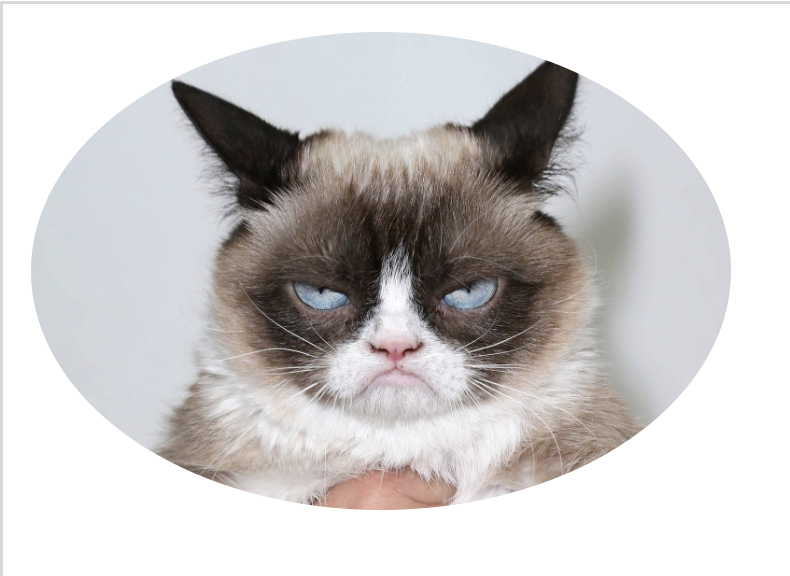

# Shapes
Everything in HTML is in a box, but we can round the corners and even make circles.

Here is some basic HTML.
```html

```
This is how our page looks.


Just adding the class name won't do anything. We can add some magic with CSS.

```css
.rounded {
  border-radius: 10%;
}
```

Now we see that the corners of the image have been rounded.


We can keep going! If we want a perfect circle with can increase the rounding percent to 50%.

```css
.rounded {
  border-radius: 50%;
}
```
 
Now we get this!



