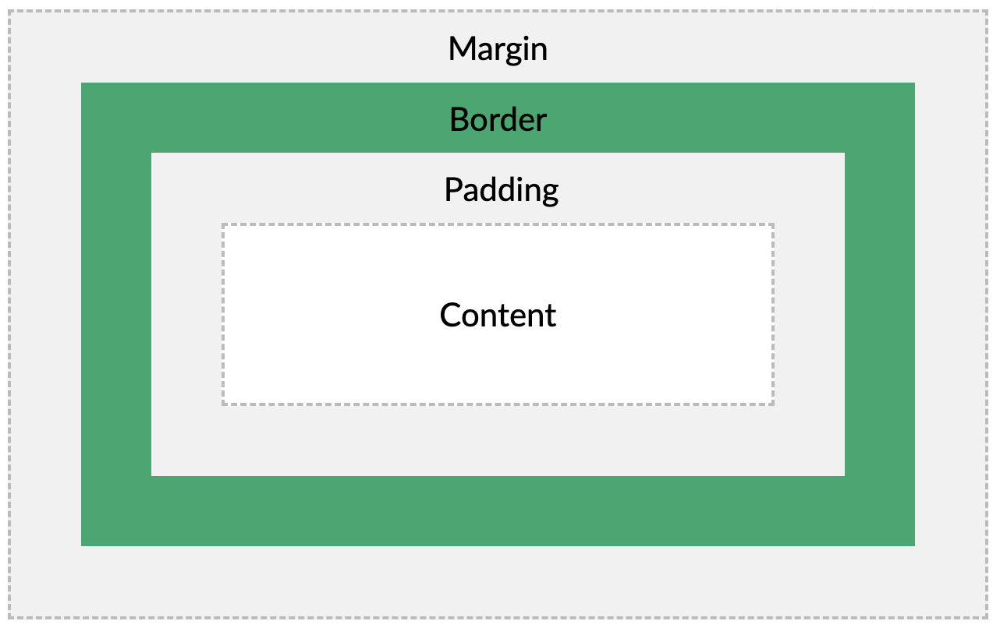
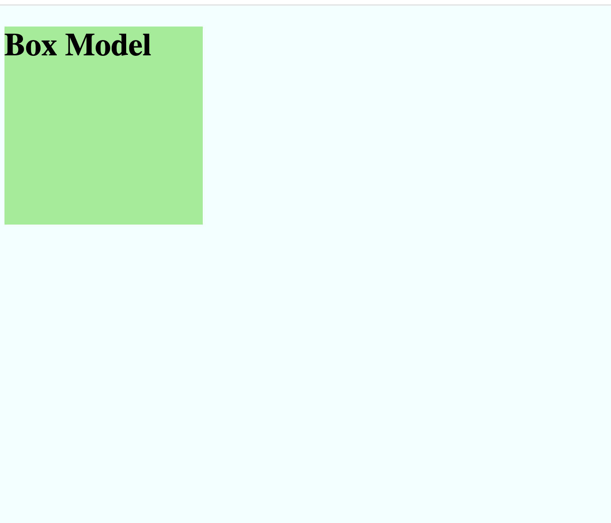
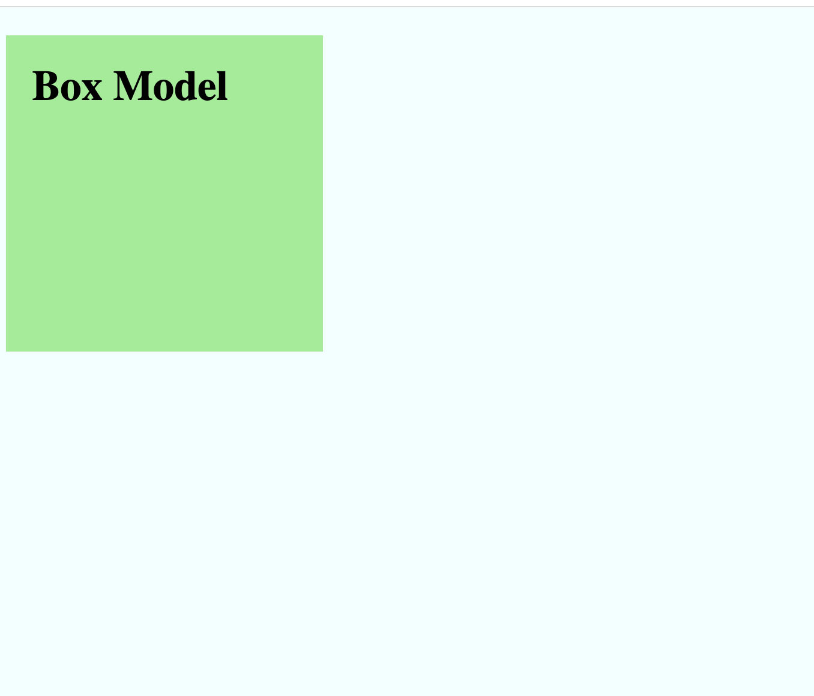
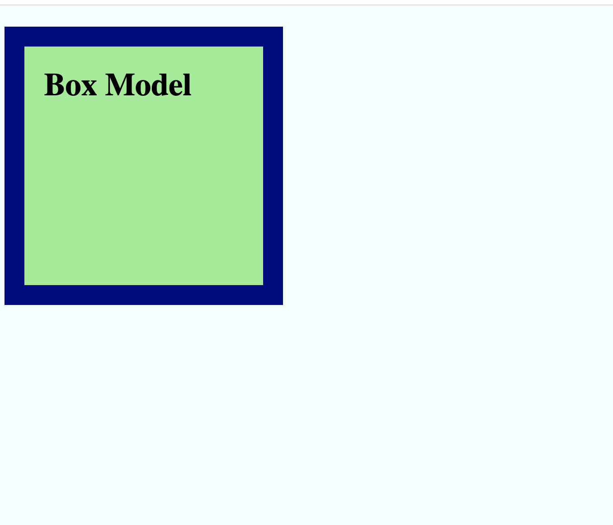
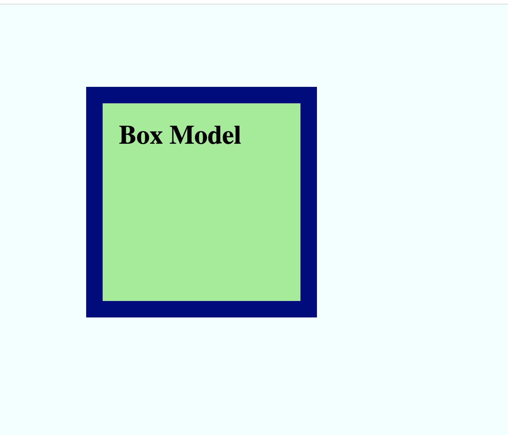

# Box Model 2 - Spacing 
In HTML, everything is a box! We can use spacing properties to change how much space each box takes up.

The size of the box is calculated by the content, padding, border, and margin.


## Content
The box will take up a certain amount of space based on the content. 

We can set the box size of any element that is `display: block` or `display: inline-blcok` with the width or height property.

```css
selector {
  display: block;
  width: 200px;
  height: 200px;
  background-color: lightgreen;
}
```

This will create a square box.



## Padding
Padding is the space around the content to the edge of it's box. Padding can be added with CSS.

This will put padding around all sides of the content.
```css
selector {
  padding: 20px;
}
```



You can also add different padding to different sides of the content.

This will only add padding to the left hand side.

```css
selector {
  padding-left: 20px;
}
```

## Border
You can add a border around any box using CSS. Borders can be any thickness and color. 


You can set the border style property to be solid, dashed, or dotted to change how the border will look.
```css
selector {
  border-width: 20px;
  border-color: navy;
  border-style: solid;
}
```
  
## Margin
Margin is space around the outside of a box.


This will add border around all sides of a box.
```css
selector {
  margin: 100px;
}
```

You can also add different margins to different sides of the content.

This will only add padding to the top of a box.
```css
selector {
  margin-top: 100px;
}
```

## [Try it now!](https://www.w3schools.com/css/tryit.asp?filename=trycss_boxmodel)
 


